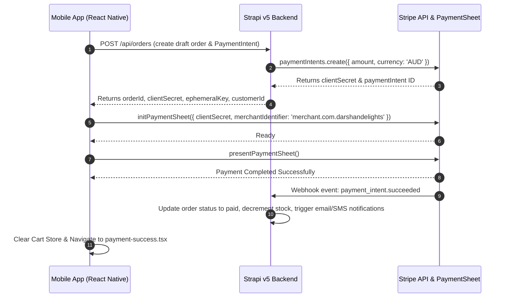

# ARCHITECTURE — Darshan Delights Mobile

High-level architectural overview, tech stack specifications, file layout, state management, and backend integration design.

---

## 1. Core Technology Stack

- **Mobile Framework:** React Native `0.81.5` on Expo SDK `~54.0.31` with **New Architecture enabled** (`newArchEnabled: true`).
- **Routing & Navigation:** `expo-router` v6 (file-based routing with typed routes enabled in `app.config.js`).
- **Styling:** NativeWind `^4.2.1` backed by Tailwind CSS `^3.4.17`, dynamic sizing via `react-native-size-matters`, and `global.css`.
- **State Management:**
  - **Client & Cart State:** `zustand` `^5.0.8` (persistent stores for Auth token, Cart items, and User Favorites).
  - **Server State & Caching:** `@tanstack/react-query` `^5.90.10` (query invalidation, caching, optimistic updates).
- **Payment Processing:** `@stripe/stripe-react-native` `0.50.3` (Stripe PaymentSheet & Apple Pay native SDKs).
- **Backend CMS & API:** Strapi v5 (hosted at `https://admino.darshandelights.com.au`), communicating over REST via custom Axios client.
- **Secure Storage:** `expo-secure-store` for Auth tokens, `@react-native-async-storage/async-storage` for offline cart state.
- **OTA Updates:** `expo-updates` `~29.0.16` (`runtimeVersion.policy = "appVersion"`).

---

## 2. Directory & Component Topology

```
darshan_delights_mobile/
├── app/                        # File-based routes (expo-router v6)
│   ├── _layout.tsx             # Global root layout (QueryProvider, StripeProvider, fonts, ErrorBoundary)
│   ├── index.tsx               # Landing / root redirect
│   ├── (auth)/                 # Authentication routes
│   │   └── login.tsx, signup.tsx, confirm-email.tsx, verify-email.tsx,
│   │       forgot-password.tsx, verify-reset-otp.tsx, reset-password.tsx, intro.tsx
│   ├── (tabs)/                 # Main bottom-tab navigation (custom dock, ADR-007)
│   │   ├── _layout.tsx         # Tab dock (Home / Products / Cart / More + hidden Search)
│   │   ├── home/               # Home tab (index, weekly-sale, popular-prods)
│   │   ├── products/           # Products tab (index, purchased-before)
│   │   ├── cart/               # Cart & checkout (index, select-shipping, payment)
│   │   ├── more/               # Account hub (index, profile, orders, addresses, favorites,
│   │   │                       #   reviews, security, notifications, help/*, notification-preferences)
│   │   └── search/             # Hidden search tab (index)
│   ├── shop/                   # Shop catalog (index — filters, brand deep-link ?brand=)
│   ├── product/[id]/           # Product detail (index, reviews, nutrition)
│   ├── highlighted-products.tsx, popular-products.tsx, short-dated.tsx, bulk-orders.tsx
│   │                           # Banner target stub routes (2026-08-02)
│   ├── favorites.tsx, notifications.tsx, payment-success.tsx
│   ├── +not-found.tsx, +html.tsx
│
├── src/                        # Application business logic & UI components
│   ├── api/                    # Axios client + per-domain Strapi REST endpoints
│   │                           #   (client, products, cart, orders, auth, addresses, favorites,
│   │                           #    reviews, notifications, coupons, shipping, contact, refund, feedback, pushTokens)
│   ├── components/             # Reusable UI components
│   │   ├── common/             # Wrapper, Button, ErrorBoundary, Loader, EmptyState, Logo,
│   │   │                       #   Offline*/Connection*/Network banner components, modals, TitleHeader
│   │   ├── home/               # HomeCarousel, CategoryList, ProductGrid, ProductHorizontalList,
│   │   │                       #   PurchasedBeforeList, RecentlyViewed, FeaturedFlipBook, banners/*, SectionHeader
│   │   ├── product/            # ProductCard, BigProductCard, ImageCarousel, ProductHeader,
│   │   │                       #   QuantitySelector, ScrollProductList
│   │   ├── cart/               # CartItemCard, CartSummary, CouponInput
│   │   ├── orders/             # OrderCard, OrderDetailsModal, OrderDeliveryProgress
│   │   ├── reviews/            # Rating, RatingSummary, ReviewCard, StarRatingInput, WriteReviewModal
│   │   ├── shop/               # FilterModal, CategoryChips, ActiveFilters
│   │   ├── search/             # SearchHeader, SearchSuggestions, RecentSearches
│   │   ├── addresses/          # AddressForm, AddressCard, AddressSelector
│   │   ├── auth/               # auth-modal, otpInput
│   │   ├── landing/            # landing_screen, slider, slide, wave
│   │   ├── skeletons/          # SkeletonBase + per-screen card skeletons
│   │   └── ui/                 # Button, Accordion, DebouncedTouchable, HomeHeader
│   ├── config/                 # App constants & env resolution
│   │   └── constants.tsx       # API URLs, Stripe publishable key getters
│   ├── constants/              # Colors.ts (AppColors palette), shipping.ts
│   ├── hooks/                  # useResponsive, useNetworkStatus, useDebounce, useDebouncedCallback,
│   │   │                       #   useRecentlyViewed, useRecentSearches, useBiometricAuth, useAppRating,
│   │   │                       #   usePushNotifications, useDeepLinking
│   │   └── queries/            # React Query hooks (useProducts, useCart, useOrders, useFavorites,
│   │                           #   useNotifications, useReviews)
│   ├── providers/              # QueryProvider (React Query)
│   ├── services/               # Native & external integrations (appRating)
│   ├── store/                  # Zustand stores (authStore, cartStore, favoritesStore,
│   │                           #   recentlyViewedStore, productStore, notificationStore, networkStore)
│   ├── themes/                 # app.constants.ts
│   ├── types/                  # TypeScript interfaces (Product, Order, Address, Review, Refund, …)
│   └── utils/                  # date, storage, share, deepLinks
│
├── assets/                     # Static images, fonts, splash screens, icons
├── app.config.js               # Dynamic Expo configuration (iOS entitlements, Android permissions, OTA)
├── eas.json                    # EAS Build & Submit profile configurations
├── DESIGN.md / PRODUCT.md      # Design system + product docs (Impeccable)
├── .impeccable/design.json     # Impeccable design-system sidecar
└── eslint.config.js            # ESLint via eslint-config-expo
```

> [!NOTE] Tab dock detail — the bottom dock is a custom rendering of `app/(tabs)/_layout.tsx`
> (floating curved cream bar, 20px radius, saffron gradient hairline, whisper-pill active state).
> See DESIGN.md § Navigation (Bottom Dock) and ADR-007 for the full spec.

---

## 3. Data Flow & Checkout Contract



---

## 4. Environment Resolution Rules

The app resolves environment configuration through `src/config/constants.tsx`:

1. When `EXPO_PUBLIC_ENV` is `"production"`, `EXPO_PUBLIC_API_URL_PROD` is used as the Strapi base URL.
2. When `EXPO_PUBLIC_ENV` is `"development"` or undefined, `EXPO_PUBLIC_API_URL_DEV` is used.
3. `EXPO_PUBLIC_STRIPE_PUBLISHABLE_KEY` is loaded dynamically. On production builds and production OTA updates, this variable **must** be fetched from the EAS Server-Side Environment via `--environment production`.
