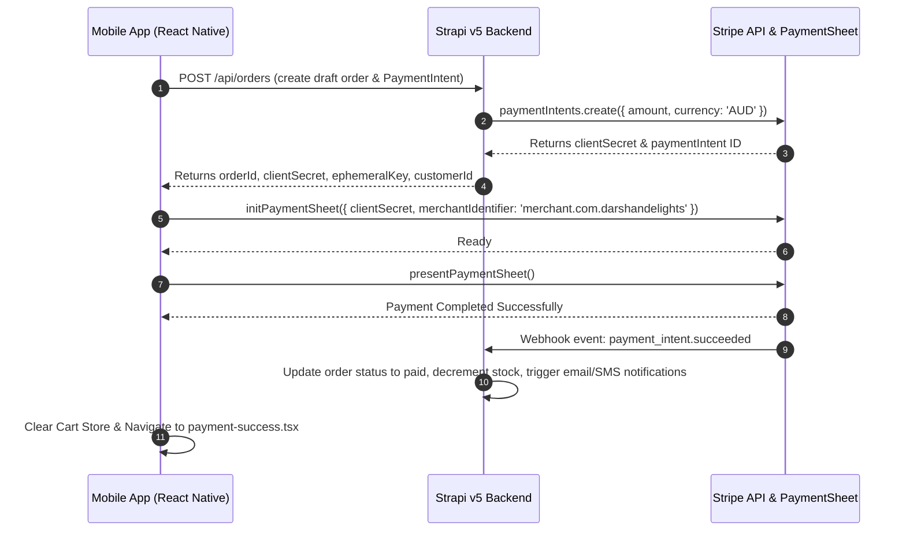

# ARCHITECTURE — Darshan Delights Mobile

High-level architectural overview, tech stack specifications, file layout, state management, and backend integration design.

---

## 1. Core Technology Stack

- **Mobile Framework:** React Native `0.81.5` on Expo SDK `~54.0.31` with **New Architecture enabled** (`newArchEnabled: true`).
- **Routing & Navigation:** `expo-router` v6 (file-based routing with typed routes enabled in `app.config.js`).
- **Styling:** NativeWind `^4.2.1` backed by Tailwind CSS `^3.4.17`, dynamic sizing via `react-native-size-matters`, and `global.css`.
- **State Management:**
  - **Client & Cart State:** `zustand` `^5.0.8` (persistent stores for Auth token, Cart items, and User Favorites).
  - **Server State & Caching:** `@tanstack/react-query` `^5.90.10` (query invalidation, caching, optimistic updates).
- **Payment Processing:** `@stripe/stripe-react-native` `0.50.3` (Stripe PaymentSheet & Apple Pay native SDKs).
- **Backend CMS & API:** Strapi v5 (hosted at `https://admino.darshandelights.com.au`), communicating over REST via custom Axios client.
- **Secure Storage:** `expo-secure-store` for Auth tokens, `@react-native-async-storage/async-storage` for offline cart state.
- **OTA Updates:** `expo-updates` `~29.0.16` (`runtimeVersion.policy = "appVersion"`).

---

## 2. Directory & Component Topology

```
darshan_delights_mobile/
├── app/                      # File-based routes (expo-router)
│   ├── (auth)/               # Authentication routes (login, register, forgot-password)
│   ├── (tabs)/               # Main bottom-tab navigation
│   │   ├── index.tsx         # Home tab (featured products, banners, categories)
│   │   ├── shop.tsx          # Shop catalog tab (search, filters, product lists)
│   │   ├── cart/             # Shopping cart & checkout flow
│   │   │   ├── index.tsx     # Cart items list & summary
│   │   │   └── payment.tsx   # Checkout & Stripe payment sheet launcher
│   │   └── account.tsx       # User profile, order history, settings
│   ├── product/              # Product detail views
│   │   └── [id]/             # Dynamic product page & reviews
│   ├── favorites.tsx         # User saved/favorite items
│   ├── notifications.tsx     # Push notification log & details
│   ├── payment-success.tsx   # Order confirmation landing page
│   └── _layout.tsx           # Global root layout (QueryProvider, StripeProvider, fonts)
│
├── src/                      # Application business logic & UI components
│   ├── api/                  # Axios HTTP client setup & Strapi REST endpoints
│   ├── components/           # Reusable UI components
│   │   ├── common/           # Shared buttons, modals, cards, badges
│   │   ├── cart/             # Cart item rows, pricing breakdowns
│   │   ├── product/          # Product cards, gallery, review widgets
│   │   └── payment/          # Stripe sheet wrappers, payment options
│   ├── config/               # Application configuration & env resolution
│   │   └── constants.ts      # API URLs, Stripe publishable key getters
│   ├── hooks/                # Custom React hooks (useAuth, useCart, useProducts)
│   ├── providers/            # React Context Providers (QueryProvider, AuthProvider)
│   ├── services/             # Native & external integration services (appRating, share, notifications)
│   ├── store/                # Zustand state stores (useAuthStore, useCartStore, useFavoritesStore)
│   ├── themes/               # Color palettes, typography definitions
│   ├── types/                # TypeScript interfaces (Product, Order, User, StrapiResponse)
│   └── utils/                # Helper functions (currency formatting, date formatters, storage)
│
├── assets/                   # Static images, fonts, splash screens, icons
├── app.config.js             # Dynamic Expo configuration (iOS entitlements, Android permissions, OTA)
└── eas.json                  # EAS Build & Submit profile configurations
```

---

## 3. Data Flow & Checkout Contract



---

## 4. Environment Resolution Rules

The app resolves environment configuration through `src/config/constants.ts`:

1. When `EXPO_PUBLIC_ENV` is `"production"`, `EXPO_PUBLIC_API_URL_PROD` is used as the Strapi base URL.
2. When `EXPO_PUBLIC_ENV` is `"development"` or undefined, `EXPO_PUBLIC_API_URL_DEV` is used.
3. `EXPO_PUBLIC_STRIPE_PUBLISHABLE_KEY` is loaded dynamically. On production builds and production OTA updates, this variable **must** be fetched from the EAS Server-Side Environment via `--environment production`.
